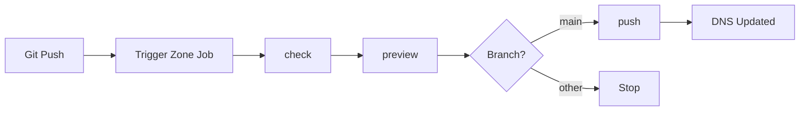
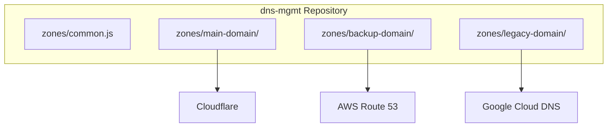

# DNSOps

> If your DNS is only managed through a web dashboard, you're one outage away from losing control.

This repository provides a GitOps approach to maanage your DNS records live in Git, changes are peer-reviewed, and deployments are automated through CI/CD. When the dashboard is down, your DNS config is still version-controlled and ready to push to a backup provider.

> [!IMPORTANT]
> **GitOps Pattern**: All DNS changes MUST be made through Git commits. Never edit DNS records directly in the provider's dashboard—changes will be overwritten on the next pipeline run.

## Why GitOps for DNS?

Managing DNS records manually through web dashboards creates several challenges:

| Challenge | GitOps Solution |
|-----------|-----------------|
| **No Audit Trail** | Full Git history - who changed what, when |
| **No Granular Access** | Branch protection, MR approvals, CODEOWNERS |
| **Provider Outages** | Config is versioned, push to backup provider |
| **Manual Errors** | Automated validation before applying |
| **Inconsistency** | Shared configs, reusable variables |

## Quick Start

### 1. Clone and Configure

```bash
git clone https://github.com/nh4ttruong/
cd dns-mgmt
```

### 2. Set CI/CD Variables

| Provider | Variables |
|----------|-----------|
| Cloudflare | `CF_ACCOUNT_ID_*`, `CF_API_TOKEN_*` |
| AWS Route 53 | `AWS_ACCESS_KEY_ID`, `AWS_SECRET_ACCESS_KEY` |
| Google Cloud | `GCLOUD_PRIVATE_KEY`, `GCLOUD_CLIENT_EMAIL` |

### 3. Edit DNS Records

```bash
nano zones/{domain}/dnsconfig.js
```

### 4. Commit and Push

```bash
git add . && git commit -m "Update DNS records"
git push origin main
```

Pipeline automatically: **check** → **preview** → **push**

---

## Repository Structure

```
dns-mgmt/
├── .gitlab-ci.yml              # Pipeline triggers per zone
├── creds.json                  # Provider credentials (env vars)
└── zones/
    ├── .gitlab-ci-template.yml # Shared pipeline template
    ├── common.js               # Shared IPs & defaults
    ├── example-com/
    │   └── dnsconfig.js        # Zone: example.com
    └── mycompany-io/
        └── dnsconfig.js        # Zone: mycompany.io
```

### Shared Configuration

```javascript
// zones/common.js
var addr = {
    "default": IP("10.0.0.10"),
    "private_ingress_uat": IP("10.0.0.70"),
    "public_ingress_uat": IP("203.0.113.19"),
    "public_ingress_production": IP("203.0.113.21"),
}
```

---

## CI/CD Pipeline



| Stage | Job | Description |
|-------|-----|-------------|
| test | `check_and_review` | Validate syntax, preview changes |
| deploy | `push` | Apply to provider (main branch only) |

---

## Provider Examples

### Cloudflare

```javascript
// zones/example-com/dnsconfig.js
require("../common.js");
var DP = NewDnsProvider("cloudflare_example_com");

D("example.com", REG_NONE, DnsProvider(DP), {no_ns: 'true'},
  A("@", addr.default),
  A("www", addr.public_ingress_production),
  CNAME("blog", "example.github.io."),
);
```

```json
"cloudflare_example_com": {
    "TYPE": "CLOUDFLAREAPI",
    "accountid": "$CF_ACCOUNT_ID_EXAMPLE_COM",
    "apitoken": "$CF_API_TOKEN_EXAMPLE_COM"
}
```

### AWS Route 53

```javascript
// zones/example-org/dnsconfig.js
require("../common.js");
var DP = NewDnsProvider("route53_example_org");

D("example.org", REG_NONE, DnsProvider(DP),
  A("@", addr.default),
  A("api", addr.public_ingress_production),
  CNAME("www", "example.org."),
);
```

```json
"route53_example_org": {
    "TYPE": "ROUTE53",
    "KeyId": "$AWS_ACCESS_KEY_ID",
    "SecretKey": "$AWS_SECRET_ACCESS_KEY"
}
```

### Google Cloud DNS

```javascript
// zones/example-io/dnsconfig.js
require("../common.js");
var DP = NewDnsProvider("gcloud_example_io");

D("example.io", REG_NONE, DnsProvider(DP),
  A("@", addr.default),
  AAAA("@", "2001:db8::1"),
);
```

```json
"gcloud_example_io": {
    "TYPE": "GCLOUD",
    "project": "my-gcp-project-id",
    "private_key": "$GCLOUD_PRIVATE_KEY",
    "client_email": "$GCLOUD_CLIENT_EMAIL"
}
```

---

## Adding a New Zone

1. **Create zone directory**

   ```bash
   mkdir zones/new-domain-com
   ```

2. **Create dnsconfig.js**

   ```javascript
   require("../common.js");
   var DP = NewDnsProvider("cloudflare_new_domain_com");
   
   D("new-domain.com", REG_NONE, DnsProvider(DP), {no_ns: 'true'},
     A("@", addr.default),
   );
   ```

3. **Add credentials to creds.json**

   ```json
   "cloudflare_new_domain_com": {
       "TYPE": "CLOUDFLAREAPI",
       "accountid": "$CF_ACCOUNT_ID_NEW_DOMAIN_COM",
       "apitoken": "$CF_API_TOKEN_NEW_DOMAIN_COM"
   }
   ```

4. **Add trigger to .gitlab-ci.yml**

   ```yaml
   new-domain-com:
     extends: .trigger-base
     variables:
       ZONE_DIR: new-domain-com
     rules:
       - changes: *common-paths
         when: manual
       - changes:
           - zones/new-domain-com/**/*
         when: always
       - when: never
   ```

5. **Set GitLab CI/CD variables**
   - `CF_ACCOUNT_ID_NEW_DOMAIN_COM`
   - `CF_API_TOKEN_NEW_DOMAIN_COM`

---

## Local Development

```bash
cd zones/{domain}

dnscontrol check                              # Validate syntax
dnscontrol preview --creds ../../creds.json   # Preview changes
dnscontrol push --creds ../../creds.json      # Apply changes
```

---

## Supported Providers

DNSControl supports **40+ providers**:

| Provider | Type | Best For |
|----------|------|----------|
| [Cloudflare](https://docs.dnscontrol.org/provider/cloudflareapi) | CDN + DNS | Proxy, WAF, DDoS protection |
| [AWS Route 53](https://docs.dnscontrol.org/provider/route53) | Cloud DNS | AWS ecosystem integration |
| [Google Cloud DNS](https://docs.dnscontrol.org/provider/gcloud) | Cloud DNS | GCP workloads |
| [Azure DNS](https://docs.dnscontrol.org/provider/azuredns) | Cloud DNS | Azure ecosystem |
| [DigitalOcean](https://docs.dnscontrol.org/provider/digitalocean) | Cloud DNS | Simple, affordable |
| [Namecheap](https://docs.dnscontrol.org/provider/namecheap) | Registrar | Domain + DNS bundled |

> Full list: [docs.dnscontrol.org/provider](https://docs.dnscontrol.org/provider)

---

## Multi-Provider Strategy

Manage multiple providers in one repository:

- **Migration** - Move zones between providers gradually
- **Redundancy** - Backup zones on secondary providers
- **Cost optimization** - Different providers for different needs



---

## References

- [DNSControl Documentation](https://docs.dnscontrol.org/)
- [Provider Reference](https://docs.dnscontrol.org/provider)
- [Language Reference](https://docs.dnscontrol.org/language-reference)
